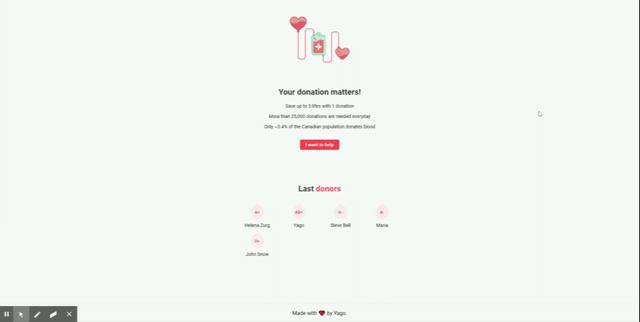

<h1 align="center">
    
</h1>

<h3 align="center">
  Donate Blood
</h3>

# :rocket: About the application

Application to raise awareness about blood donation.  

To know more about blood donation, please access: [Blood.ca](https://www.blood.ca/en).

<h1 align="center">
    
</h1>

## Getting started

1. Clone this repo using `git clone https://github.com/yagosansz/donate-blood.git`
2. Move yourself to the appropriate directory: `cd donate-blood` 
3. Run `yarn` to install dependencies 

### Getting started with the backend server

1. Set up docker on your machine [Docker Toolbox](https://chocolatey.org/packages/docker-toolbox) by using [Chocolatey](https://chocolatey.org/)
2. Run  `docker pull postgres` from the Docker CLI
3. Run `docker run --name postgres -d -p 5432:5432 -e POSTGRES_PASSWORD=postgres -d postgres` from the Docker CLI
4. Create your database through [Postbird](https://www.electronjs.org/apps/postbird) or other PostgreSQL GUI client of your preference
5. Run `yarn start` to start the server

[Why use Docker instead of installing Postgres?](https://hackernoon.com/dont-install-postgres-docker-pull-postgres-bee20e200198)

  ---

Made with ♥ by Yago!